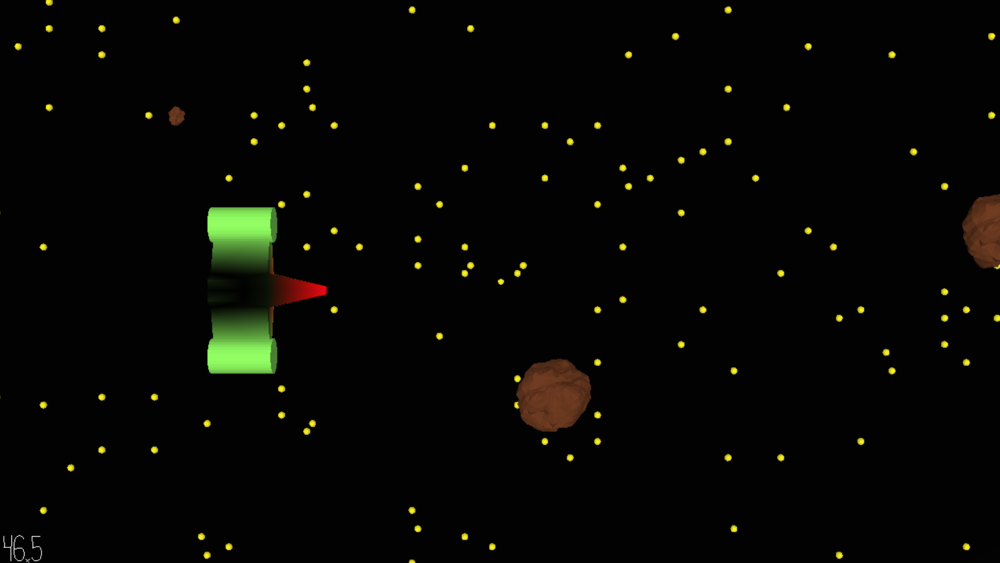

# Earth Defense V: The Killer Asteroids

Author: Woody McCoy

Design: Fly around as a spaceship, destroying asteroids before they make it off screen!

Screen Shot:

How Your Asset Pipeline Works:

Files are moved from blender to a .pnct file and a scene file. From these, assets are loaded, and the game copies this data to spawn entities.

How To Play:

WASD to move your ship, and space to fire. Don't let any asteroids escape your screen, or you will lose!

Sources: N/A

This game was built with [NEST](NEST.md).

